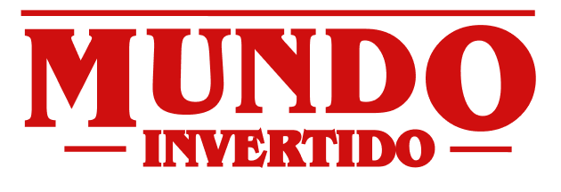
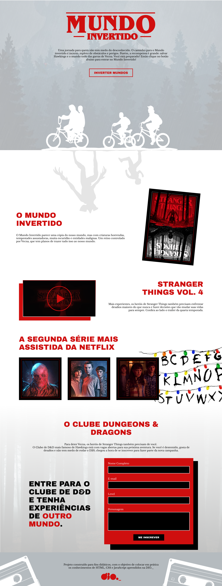
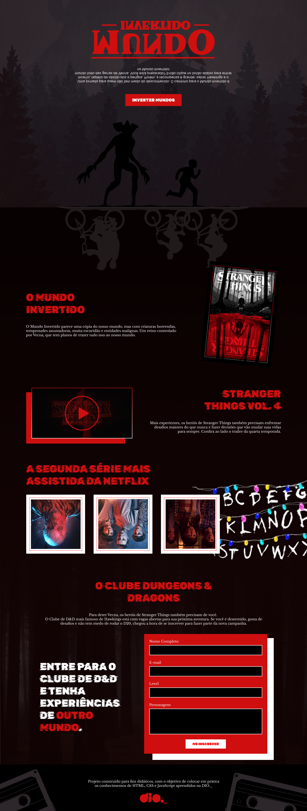

  
  

## Introdução 🔥
Site desenvolvido baseado na série Stranger Things usando HTML, SCSS e JavaScript no bootcamp da DIO. 

## Tecnologias usadas 📦
- HTML
- SCSS
- JavaScript

## Autores 👷

- **Tatyane Gonçalves** - *Desenvolvedora* - [@tatyanepgoncalves](https://github.com/tatyanepgoncalves)
- **Diogo Mainardes** - [@diogomainardes](https://github.com/diogomainardes)
- **Michele Ambrosio** - *Dev Frontend e Tech Lead* [@micheleambrosio](https://github.com/micheleambrosio)
- **Renan Paula** - *Criador do Projeto e Tech Edutor* - [@RenanJPaula](https://github.com/RenanJPaula)

  

  

